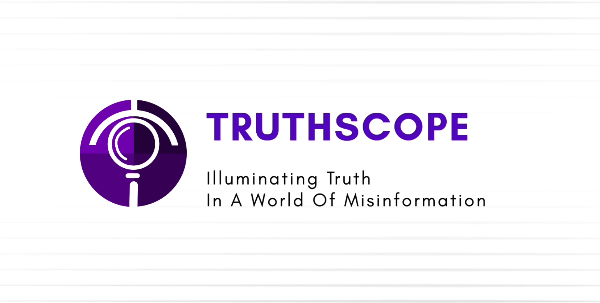

# TruthScope – AI‑powered Misinformation Detection



TruthScope is a full-stack project that helps users assess the credibility of online content. It includes:

- A Chrome extension that analyzes the page you’re viewing (text and media) and shows a credibility assessment with highlights.
- Python backend services for text and media analysis, using Google Cloud (Vertex AI, Vision, Translate, etc.) and third‑party APIs.
- A Next.js landing site for the public-facing marketing page.

This README covers the entire repository: how it’s organized, how to run it locally, how to test, and how to deploy to Google Cloud Run.

## Repository structure

```
.
├─ README.md                         # You are here
├─ image.png                         # Hero image used above
├─ final_output.json                 # Sample output artifact
├─ extension/                        # Browser extension + backend services
│  ├─ frontend/                      # Chrome extension (Manifest v3)
│  │  ├─ content.js, background.js, popup.* , sidepanel.* , manifest.json, ...
│  │  └─ README.md                   # Extension details and architecture
│  └─ backend/                       # Python Flask services (text/media analysis)
│     ├─ check_text.py               # Text credibility analysis (Vertex AI, Fact Check, etc.)
│     ├─ check_media.py              # Image/Video/Audio analysis (Sightengine/OCR, etc.)
│     ├─ requirements.txt, Dockerfile, SETUP_GUIDE.md, db.sql, ...
│     └─ tests: test_api.py, test_backend.py, test_json_format.py
└─ landing/                          # Next.js 15 + Tailwind landing site
   ├─ app/, components/, public/     # UI and assets (TruthScope_Logo.png, etc.)
   └─ package.json, next.config.mjs
```

## What’s inside

- Chrome Extension (Manifest v3)
  - Extracts article text and media via `content.js`
  - Sends data to the background script, which calls backend APIs
  - Displays summary in `popup.html` and details in a side panel (`sidepanel.html`)
  - Google Sign‑In (OAuth) configured in `manifest.json`
- Backend (Python/Flask)
  - `check_text.py`: Uses Google Cloud services (Vertex AI, Translate, Fact Check Tools, Custom Search) and Cloud SQL
  - `check_media.py`: Uses Sightengine for image/video and OCR.space for text from images; paid endpoints for video/audio
  - Deployed to Cloud Run with Docker; Postgres via Cloud SQL; `.env` driven config
- Landing site (Next.js 15 + Tailwind CSS)
  - Public site with sections, theming, and components under `landing/`

## Prerequisites

- Windows 10/11 (commands below use cmd.exe)
- For Backend services:
  - Python 3.11+
  - A Google Cloud Project (for text analysis service) and the required APIs enabled
  - Postgres (local or Cloud SQL) for user/tier data
- For Landing site:
  - Node.js 20+
  - pnpm (recommended) or npm
- For Extension:
  - Google Chrome (latest)

## Quick start (local)

You can run the pieces independently. Start with the backend services, then the extension, and optionally the landing site.

### 1) Backend – Text analysis service (`check_text.py`)

- Install dependencies:

```bat
cd extension\backend
python -m venv .venv
.venv\Scripts\activate
pip install -r requirements.txt
```

- Create and fill out environment variables:

```bat
copy .env.example .env
REM Edit .env and set values (GCP project, Cloud SQL, API keys, OAuth client ID, etc.)
```

- Run the service (port can be controlled via PORT; defaults may vary in dev vs Docker):

```bat
set PORT=8080 & python check_text.py
```

Tip: The Dockerfile uses Gunicorn on port 8080. Some test scripts default to 5000—use PORT to align, or adjust the test URLs.

### 2) Backend – Media analysis service (`check_media.py`)

- Reuse the same venv as above (already activated) and .env values for Sightengine/OCR keys.
- Run the media server:

```bat
python check_media.py
```

By default this service commonly runs on port 3000 (see logs on startup). The image endpoint is typically open; video/audio may require paid tier and a user with `paid` role.

### 3) Chrome extension (frontend)

- Update the backend URLs in `background.js` if needed (to match ports you used).
- Load the extension in Chrome:
  - Go to chrome://extensions
  - Enable “Developer mode”
  - Click “Load unpacked” and select `extension/frontend`
  - Open any news article; the extension will analyze and show a summary in the popup and details in the side panel

OAuth: The extension is configured with a Google OAuth client in `manifest.json` (identity scope). Ensure your backend verifies tokens and user tiers.

### 4) Landing site (Next.js)

```bat
cd landing
pnpm install
pnpm dev
```

The site will start at http://localhost:3000. You can customize components under `landing/components` and assets under `landing/public`.

## Configuration

Backend environment variables are documented in `extension/backend/SETUP_GUIDE.md`. Key ones include:

- GCP: `GCP_PROJECT_ID`, `GCP_LOCATION`, `GOOGLE_CLIENT_ID`, `GOOGLE_API_KEY`, `GOOGLE_FACT_CHECK_API_KEY`, `GOOGLE_CUSTOM_SEARCH_ENGINE_ID`
- Database/Cloud SQL: `CLOUD_SQL_CONNECTION_NAME`, `DB_NAME`, `DB_USER`, `DB_PASSWORD`
- Media APIs: `SIGHTENGINE_API_USER`, `SIGHTENGINE_API_SECRET`, `OCR_SPACE_API_KEY`

Database schema: see `extension/backend/db.sql`. There are helper scripts for fixing permissions and Cloud SQL notes.

## Testing

There are simple test scripts for the backend in `extension/backend`:

- Quick health/API check (text service on 8080):

```bat
cd extension\backend
.venv\Scripts\activate
python test_api.py
```

- Full suite (requires valid Google access token for authenticated endpoints and both services running):

```bat
python test_backend.py
```

- JSON contract checks (ensures responses follow the expected shape):

```bat
python test_json_format.py
```

Note: `test_backend.py` reads `TEXT_BACKEND_URL` and `MEDIA_BACKEND_URL` from env (defaults: 5000 and 3000). Set `TEST_ACCESS_TOKEN` in the file or via headers for auth-required endpoints.

## Deployment (Google Cloud Run)

- See `extension/backend/CLOUD_RUN_DEPLOYMENT.md`, `SETUP_GUIDE.md`, and `deploy.sh` for end-to-end steps:
  - Create project, enable APIs, provision Cloud SQL (Postgres)
  - Build and deploy container to Cloud Run (text/media services)
  - Configure environment variables and/or Secret Manager
  - Verify with the sample curl commands in the guide

The provided `Dockerfile` runs the text service via Gunicorn on `$PORT` (default 8080). You can override the command to run media analysis if deploying that service instead.

## Troubleshooting

- Service won’t start: check logs, `.env` completeness, Cloud SQL connectivity, and IAM roles (see SETUP_GUIDE’s Troubleshooting section)
- Auth errors (401/403): verify the Google OAuth token and the user’s tier in the database (`users` table)
- Media analysis timeouts: large videos take longer; ensure you’re on a paid tier (where required) and increase timeouts as needed
- Extension not analyzing: confirm `content.js` runs on the page, background URLs are correct, and the side panel is enabled

## Notes and next steps

- You can swap the banner to `landing/public/TruthScope_Logo.png` if you prefer a different look.
- Consider adding CI for lint/tests and a small contribution guide.
- For production, pin dependencies and set up automatic deploys to Cloud Run.

---

If you need help wiring the extension to a deployed backend (Cloud Run) or want me to polish the landing page copy/screenshots, let me know and I’ll add those next.
